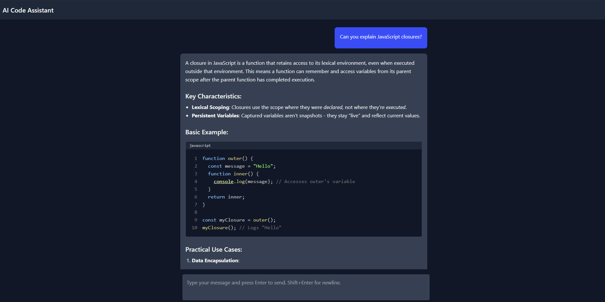

# 🧠 AI Chat App (with Markdown & Code Snippet Support)

This is a simple AI assistant app built with:

- **React** + **TailwindCSS** for the frontend
- **Fastify** for the backend
- **OpenRouter API** as the AI provider
- Markdown rendering with support for syntax-highlighted code blocks

> ✅ This version supports full message exchange with Markdown and code blocks.
>
> 🚀 _Streaming responses coming soon!_

## ✨ Features

- Ask AI any coding or general questions
- AI responses rendered with **Markdown** formatting
- Code snippets are auto-detected and syntax-highlighted with `react-syntax-highlighter`
- Messages are styled like a chat UI (user & assistant layout)

## 🎞️ Tech Stack

- Frontend: React, TailwindCSS, TypeScript
- Backend: Fastify, TypeScript
- AI Provider: [OpenRouter](https://openrouter.ai/)
- Model: `microsoft/mai-ds-r1:free` (free)
- Markdown: ReactMarkdown
- Code Highlighting: PrismJS

## 🛠️ Getting Started

### 1. Clone the repo

```bash
git clone git@github.com:antonis-zisis/ai-code-assistant.git
cd ai-code-assistant
```

### 2. Install dependencies

**Frontend:**

```bash
cd app
bun install
```

**Backend:**

```bash
cd server
bun install
```

### 3. Add your OpenRouter API key

_You need to create an account with OpenRouter and generate an API key._

Create a `.env` file inside the `server` folder:

```env
OPENROUTER_API_KEY=your_openrouter_api_key
```

### 4. Start the servers

**Backend:**

```bash
cd server
bun start
```

**Frontend:**

```bash
cd app
bun dev
```

The app will be available at `http://localhost:3000`.

## 🔄 Future Improvements

- [ ] Streaming responses using `ReadableStream` for real-time typing
- [ ] Token usage tracking
- [ ] Ability to choose models
- [ ] Chat history persistence

## 📸 Screenshots



## 🔫 Example Prompt

```text
Can you explain JavaScript closures?
```

## 🔧 Switching Models

This project currently uses the free-tier `microsoft/mai-ds-r1:free` model via OpenRouter.

To change the model:

1. Open the server route in `routes/ai.ts`.
2. Locate the model name inside the POST request to OpenRouter:

```ts
const response = await axios.post(
  'https://openrouter.ai/api/v1/chat/completions',
  {
    model: 'microsoft/mai-ds-r1:free', // Change this to your preferred model
    messages,
  },
  {
    headers: {
      Authorization: `Bearer ${process.env.OPENROUTER_API_KEY}`,
      'Content-Type': 'application/json',
    },
  }
);
```

## 📄 License

MIT — feel free to use and adapt!

## ✨ Credit

Built with ❤️ by [Antonis](https://www.antoniszisis.com)
